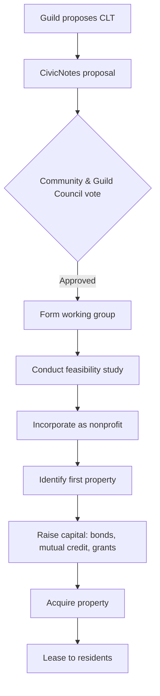
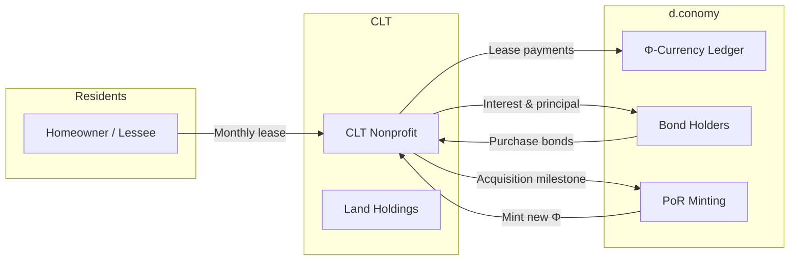
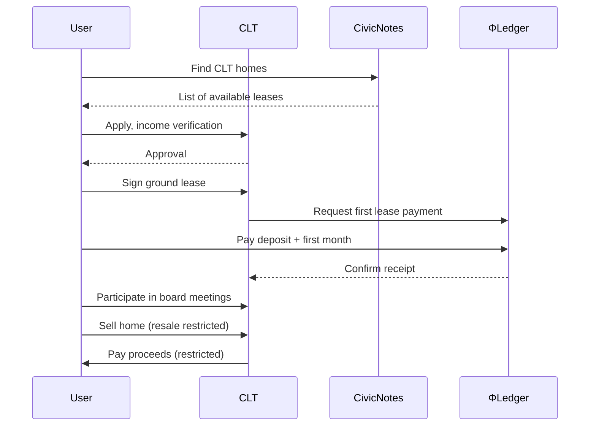
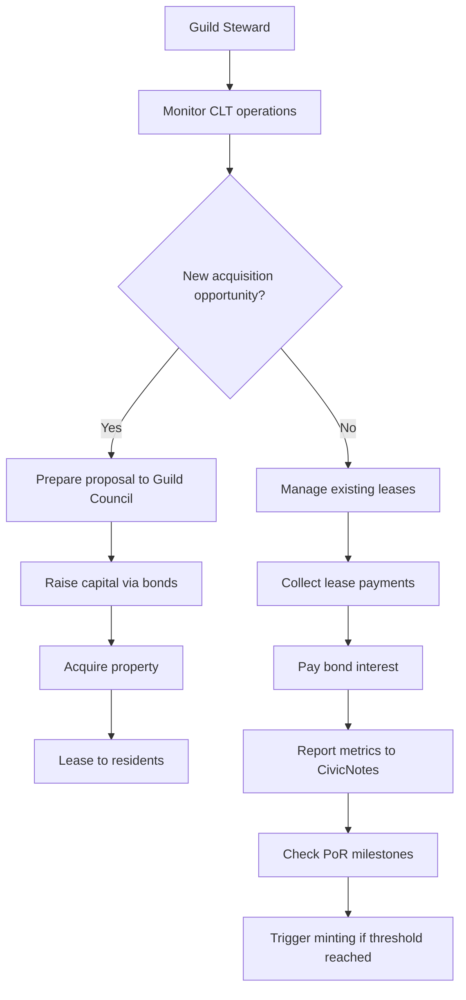
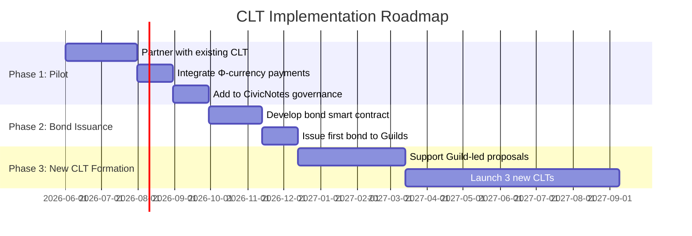

# Community Land Trust (CLT)

## 1. Introduction

A **Community Land Trust** (CLT) is a nonprofit organization that acquires and holds land in trust for the benefit of a community. It separates land ownership (held by the trust) from building ownership (held by residents or other entities). This structure permanently removes land from speculative markets, ensuring long‑term affordability and community control. CLTs are a foundational **Game B** institution for land stewardship, aligning with d.conomy’s goal of replacing private property with communal stewardship.

In d.conomy, CLTs are managed by Guilds in collaboration with residents, integrate with Φ‑currency for lease payments and bond issuance, and are tracked via the Φ‑Grid as a key indicator of community health.

## 2. Rationale & Deep Research

### 2.1 Historical Roots

The modern CLT model emerged in the United States in the 1960s, inspired by the civil rights movement and the need for affordable housing. The first CLT was founded in 1969 in New Communities, Georgia, by a group of Black farmers seeking to secure land tenure. Since then, CLTs have spread globally, with thousands of CLTs now operating in the US, UK, Canada, and elsewhere.

Key historical influences include:

- **Gandhian Gramdan movement** – Villagers collectively held land.
- **Israeli kibbutzim** – Collective ownership and democratic governance.
- **UK garden cities** – Early forms of community landholding.

### 2.2 Economic Benefits

- **Permanent Affordability** – CLTs use ground leases and resale restrictions to ensure homes remain affordable for future generations.
- **Stability** – Residents are protected from rent increases and displacement.
- **Local Investment** – CLTs often leverage community capital (via bonds or mutual credit) rather than speculative financing.

### 2.3 Social & Relational Benefits

- **Democratic Governance** – CLT boards typically include residents, community members, and public representatives, ensuring accountability.
- **Community Empowerment** – Residents have a voice in land use decisions, fostering a sense of ownership and belonging.
- **Intergenerational Equity** – CLTs embody the principle of “stewardship for the future.”

### 2.4 Environmental Benefits

- **Anti‑Speculation** – By removing land from markets, CLTs prevent land‑based carbon emissions associated with sprawl and conversion.
- **Green Space Preservation** – Many CLTs protect community gardens, parks, and natural areas.
- **Climate Resilience** – CLTs can prioritize sustainable building practices and community‑scale renewable energy.

### 2.5 Alignment with Solarpunk Mandala & d.conomy

| Mandala Concept | CLT Instantiation |
|-----------------|-------------------|
| **Game B** | Replaces private land ownership with collective stewardship. |
| **Temporal Orientation Axis (Courage)** | Repairs historical land dispossession; seeds permanent affordability. |
| **Axiological Axis (Care)** | Ensures future generations have access to land and housing. |
| **Symbiotic Commonwealth (Appendix S)** | A node in the mesh governance structure; CLTs are often federated. |
| **Regenerative Economy (Appendix T)** | Integrates with Φ‑currency for lease payments and PoR minting. |

### 2.6 Critical Considerations & Responses

| Critique | Response |
|----------|----------|
| *“CLTs restrict property rights.”* | They balance individual rights with collective responsibility; residents still own their homes, just not the land. |
| *“They are hard to scale.”* | CLTs can be formed incrementally and networked through federations; many cities now support CLT growth. |
| *“They require substantial upfront capital.”* | d.conomy provides mechanisms: Φ‑currency bonds, mutual credit, and PoR grants can fund acquisitions. |

## 3. Governance Model

CLTs in d.conomy are governed by a **tripartite board** structure, adapted from the classic CLT model:

- **Resident Members** – Leaseholders and homeowners (at least 1/3 of board).
- **Community Members** – Residents of the surrounding area, not necessarily CLT residents (1/3).
- **Public / Guild Representatives** – Appointed by the Guild Council or local government (1/3).

Decisions are made transparently via CivicNotes, with proposals and meeting minutes published.

### 3.1 Formation Process

1. **Guild Proposal** – A Guild (or coalition) submits a CivicNotes proposal to form a CLT.
2. **Community Feasibility** – A working group assesses land availability, community need, and financing.
3. **Legal Incorporation** – The CLT is incorporated as a nonprofit.
4. **First Acquisition** – The CLT acquires its first property using a combination of mutual credit, Φ‑currency grants, and traditional financing (if needed).



### 3.2 Ongoing Operations

- **Ground Leases** – The CLT leases land to residents for 99 years, with resale restrictions.
- **Stewardship** – The CLT maintains common areas, supports resident‑led improvements, and ensures lease compliance.
- **Community Engagement** – Regular meetings, CivicNotes updates, and participatory budgeting.

## 4. Economic Integration

### 4.1 Lease Payments & Φ‑Currency

- Residents pay a **ground lease** (monthly or annual) to the CLT. This can be denominated in Φ‑currency, reducing reliance on fiat.
- Lease payments are set at affordable levels (typically 25‑30% of household income) and adjusted for inflation via a formula.

### 4.2 Land Stewardship Bonds

- CLTs can issue **bonds** denominated in Φ‑currency to raise capital for acquisitions.
- Bonds are purchased by Guilds, mutual credit circles, or individual members.
- Interest is paid in Φ‑currency, with repayment funded by lease payments.

### 4.3 Proof‑of‑Regeneration (PoR) Minting

- When a CLT acquires a new property or completes a major improvement (e.g., installing solar panels), a **PoR event** is triggered.
- New Φ‑currency is minted and credited to the CLT or the supporting Guilds.

### 4.4 Integration with Φ‑Grid

- CLT data (number of affordable units, acres preserved, lease payments, etc.) feeds the Φ‑Grid, contributing to the **Resource Flow** and **Responsiveness** sub‑metrics.



## 5. Technical Implementation

### 5.1 Data Model (Simplified)

```sql
-- CLT tables
CREATE TABLE clts (
    id UUID PRIMARY KEY,
    name VARCHAR(255),
    legal_name VARCHAR(255),
    formed_at TIMESTAMP,
    guild_sponsor_id UUID REFERENCES guilds(id),
    is_active BOOLEAN DEFAULT TRUE
);

CREATE TABLE clt_properties (
    id UUID PRIMARY KEY,
    clt_id UUID REFERENCES clts(id),
    address TEXT,
    parcel_id VARCHAR(100),
    acquired_at TIMESTAMP,
    acquisition_cost_phi DECIMAL(10,2),
    current_lease_id UUID,
    is_held BOOLEAN DEFAULT TRUE
);

CREATE TABLE clt_leases (
    id UUID PRIMARY KEY,
    property_id UUID REFERENCES clt_properties(id),
    lessee_id UUID REFERENCES users(id),
    start_date DATE,
    end_date DATE,
    monthly_lease_phi DECIMAL(10,2),
    resale_restriction TEXT
);

CREATE TABLE clt_bonds (
    id UUID PRIMARY KEY,
    clt_id UUID REFERENCES clts(id),
    issued_at TIMESTAMP,
    maturity_years INTEGER,
    face_value_phi DECIMAL(10,2),
    interest_rate DECIMAL(5,2),
    status VARCHAR(20) -- 'active', 'redeemed'
);
```

### 5.2 API Endpoints (Examples)

- GET /api/clt/list – List CLTs in the region.

- POST /api/clt/propose – Submit CivicNotes proposal for a new CLT.

- GET /api/clt/{id}/properties – List properties owned by a CLT.

- POST /api/clt/{id}/bond/issue – Issue a land stewardship bond (requires Guild Council approval).

- GET /api/clt/metrics – Retrieve CLT data for Φ‑Grid.

### 5.3 Integration with CivicNotes

- **Governance** – CLT board meetings, proposals, and decisions are published via CivicNotes.

- **Promise Tracker** – CLT acquisitions and milestones are tracked as promises, with community verification.

- **Guild Dashboard** – Sponsoring Guilds see CLT financials, lease status, and bond performance.

### 5.4 Smart Contract (Optional)

For decentralized implementations, a CLT can be represented by a smart contract that:

- Manages ground leases as NFTs (representing the leasehold interest).

- Issues bonds as tokenized debt.

- Accepts Φ‑currency payments.

- Automatically triggers PoR minting upon verified milestones.

## 6. User Flows

### 6.1 Resident Journey

1. **Discover** – User learns about the CLT via CivicNotes or community outreach.

2. **Apply** – Submits application for a lease; undergoes income verification.

3. **Lease Signing** – Signs ground lease; pays deposit and first month’s lease in Φ.

4. **Reside** – Lives in home; participates in CLT governance (if resident board member).

5. **Resell** – When moving, sells home at a price restricted by the ground lease; CLT exercises right of first refusal.



### 6.2 Guild Steward Journey

1. **Form CLT** – Guild submits CivicNotes proposal; coordinates feasibility study.

2 **Acquire Land** – Raises capital via bonds, mutual credit, and PoR grants; purchases property.

3. **Lease Management** – Onboards residents; collects lease payments; maintains property records.

4. **Report** – Generates annual impact report; triggers PoR events for milestones.



## 7. References

### 7.1 Academic & Policy

- Davis, J. E. (2014). The Community Land Trust Reader. Lincoln Institute of Land Policy.

- DeFilippis, J. (2004). Unmaking Goliath: Community Control in the Face of Global Capital. Routledge.

- **Ground Leasing & CLT Toolkit – National CLT Network (US)**. https://cltnetwork.org

- **UK CLT Network – Resources and case studies**. https://www.communitylandtrusts.org.uk

### 7.2 Existing Projects

- **Dudley Street Neighborhood Initiative** (Boston) – A pioneering CLT that combines land trust with community planning.

- **Champlain Housing Trust** (Vermont) – One of the largest CLTs in the US, with over 3,000 affordable homes.

- **London Community Land Trust** – Developer of the first CLT housing in London.

### 7.3 Mandala Appendices

- **Appendix T: The Regenerative Economy** – Φ‑currency, bonds, PoR.

- **Appendix S: The Symbiotic Commonwealth** – Mesh governance, federated CLTs.

- **Appendix Q: Consciousness Infrastructure** – Φ‑Grid tracking of land stewardship.

## 8. Next Steps for Implementation

- **Pilot** – Partner with an existing CLT to integrate with CivicNotes and accept Φ‑currency for lease payments.

- **Develop Bond Issuance** – Create a prototype for land stewardship bonds using Φ‑currency.

- **Governance Integration** – Build CivicNotes modules for CLT board meetings and resident voting.

- **Scale** – Support the formation of new CLTs through Guild‑led proposals.


