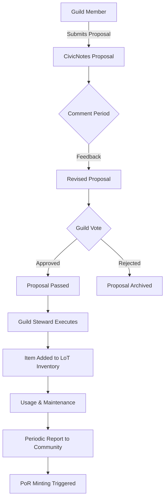
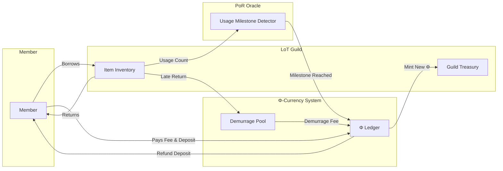
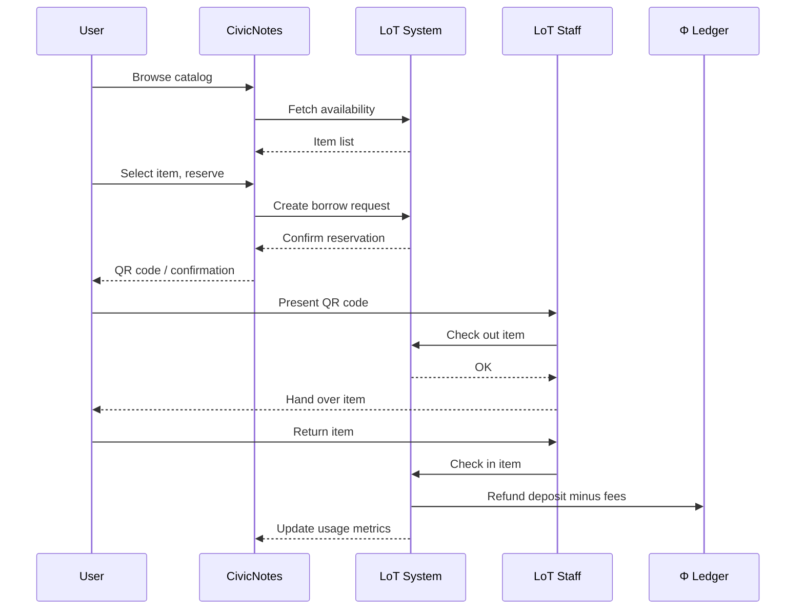
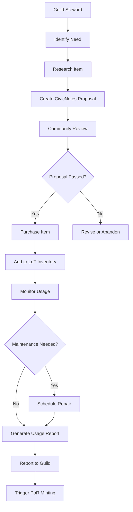
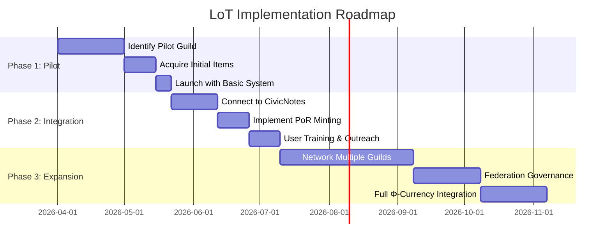

# Library of Things (LoT)

## 1. Introduction

A **Library of Things** (LoT) is a community‑owned inventory of durable goods—tools, appliances, vehicles, sports equipment, and more—that members can borrow rather than purchase and store individually. LoTs reduce the economic and environmental costs of private ownership, foster neighborly relationships, and build a culture of stewardship.

In the context of d.conomy, LoTs are a foundational **Game B** institution: they transform private property into a shared commons, governed transparently by local Guilds and integrated with Φ‑currency and the Promise Tracker.

## 2. Rationale & Deep Research

### 2.1 Historical Roots

The concept of sharing durable goods is not new. Indigenous and traditional societies practiced communal ownership of tools and land. Modern “tool libraries” emerged in the 1970s (e.g., Berkeley Tool Library, 1979) as a response to consumerism and a desire for mutual aid. In recent decades, the **sharing economy** has been co‑opted by corporations (Uber, Airbnb), but community‑owned LoTs represent a **regenerative alternative**—one that prioritizes access over ownership and collective benefit over profit.

### 2.2 Economic Benefits

- **Reduced Household Costs** – A study by the Toronto Tool Library estimated that members save an average of CAD $1,200 per year by borrowing instead of buying infrequently used items.
- **Increased Local Multiplier** – Money saved on purchases can be reinvested in the local economy, especially when LoTs accept local currencies (like Φ).
- **Job Creation** – LoTs often employ staff for maintenance, repair, and coordination; they also create opportunities for skilled volunteers.

### 2.3 Environmental Impact

- **Embodied Carbon Reduction** – Manufacturing a single power drill emits ~40 kg CO₂e. If 100 people share one drill, the emissions per person drop to 0.4 kg.
- **Waste Prevention** – LoTs extend product lifecycles through repair and reuse, diverting tons of waste from landfills.
- **Circular Economy** – LoTs are a tangible implementation of the circular economy’s “product‑as‑a‑service” model, owned and governed by the community.

### 2.4 Social & Relational Benefits

- **Neighborly Connection** – LoTs become gathering places, fostering trust and social capital—essential for resilient communities.
- **Skill Sharing** – Members learn repair skills, reducing dependence on external services.
- **Equity** – LoTs lower barriers to access: a low‑income family can use a high‑quality lawnmower or pressure washer without a large upfront cost.

### 2.5 Alignment with Solarpunk Mandala & d.conomy

| Mandala Concept | LoT Instantiation |
|-----------------|-------------------|
| **Game B** | Replaces private ownership with collective stewardship. |
| **Axiological Axis (Care)** | Reduces ecological footprint; enables future generations to access resources. |
| **Relational Depth Axis (Complexity)** | Builds interdependent networks of trust and mutual aid. |
| **Symbiotic Commonwealth (Appendix S)** | A node in the mesh governance structure. |
| **Regenerative Economy (Appendix T)** | Integrates with Φ‑currency and PoR minting. |

### 2.6 Critical Considerations & Responses

| Critique | Response |
|----------|----------|
| *“People will steal or damage items.”* | Community governance + collateral deposits (Φ‑currency) create accountability. Proven success in hundreds of tool libraries worldwide. |
| *“It’s too expensive to run.”* | Membership fees, volunteer labor, and Φ‑currency grants from PoR events can sustain operations. Many LoTs are self‑funding. |
| *“It doesn’t scale.”* | LoTs can be networked: a federation of Guild‑managed LoTs can share inventory and best practices. The d.conomy mesh allows scaling without centralization. |

## 3. Governance Model

LoTs are managed by one or more **Guilds** (verified via CivicNotes) with oversight from the community.

### 3.1 Guild Responsibilities

- **Acquisition** – Propose new items via CivicNotes, with budget justification.
- **Maintenance** – Schedule regular inspections, repairs, and replacements.
- **Borrowing Rules** – Set loan periods, late fees (in Φ), and deposit requirements.
- **Transparency** – Publish inventory status, usage statistics, and financial reports.

### 3.2 Decision‑Making

All major decisions follow the CivicNotes proposal process:

1. **Proposal** – Guild member submits a proposal (e.g., “Buy a community table saw”).
2. **Comment Period** – 7–14 days for community feedback.
3. **Vote** – Guild members vote (with weight based on reputation or stake).
4. **Implementation** – Approved proposal is executed, recorded in the Promise Tracker.



## 4. Economic Integration

### 4.1 Borrowing Fees & Φ‑Currency

- Members may pay a small **Φ‑currency fee** per borrow, which helps cover maintenance.
- Alternatively, a **mutual credit** system can be used: each borrow adds a debit to the member’s account, balanced by volunteer hours or other contributions.

### 4.2 Demurrage & Incentives

- Long‑term holds (e.g., >30 days) incur a **demurrage fee** in Φ, encouraging turnover and preventing hoarding.
- Frequent borrowers who return items on time earn “reliability points” that reduce future fees.

### 4.3 Proof‑of‑Regeneration (PoR) Minting

- When a LoT item reaches a usage milestone (e.g., 100 borrows), a **PoR event** is triggered.
- New Φ‑currency is minted and credited to the LoT Guild, providing a sustainable funding stream.



## 5. Technical Implementation

### 5.1 Data Model (Simplified)

```sql
-- Core LoT tables extending CivicNotes database
CREATE TABLE lot_items (
    id UUID PRIMARY KEY,
    guild_id UUID REFERENCES guilds(id),
    name VARCHAR(255),
    description TEXT,
    category VARCHAR(100),
    quantity INTEGER,
    deposit_phi DECIMAL(10,2),
    borrow_fee_phi DECIMAL(10,2),
    demurrage_per_day_phi DECIMAL(10,2),
    created_at TIMESTAMP
);

CREATE TABLE lot_borrows (
    id UUID PRIMARY KEY,
    item_id UUID REFERENCES lot_items(id),
    borrower_id UUID REFERENCES users(id),
    borrowed_at TIMESTAMP,
    due_at TIMESTAMP,
    returned_at TIMESTAMP,
    phi_fee_paid DECIMAL(10,2),
    demurrage_charged DECIMAL(10,2)
);

CREATE TABLE lot_usage_metrics (
    item_id UUID PRIMARY KEY,
    total_borrows INTEGER,
    total_phi_generated DECIMAL(10,2),
    last_por_milestone INTEGER
);
```

### 5.2 API Endpoints (Examples)

- GET /api/lot/items – List available items, filter by category/guild.

- POST /api/lot/borrow – Reserve an item; deduct deposit from user’s Φ balance.

- POST /api/lot/return – Return item; refund deposit minus fees; update usage metrics.

- GET /api/lot/metrics – Retrieve usage data for PoR calculation.

### 5.3 Integration with CivicNotes

- Authentication – Uses same OAuth tokens.

- Guild Dashboard – Shows LoT inventory, financial summaries, and pending proposals.

- User Profile – Displays current borrows, past loans, and earned PoR credits.

### 5.4 Smart Contract (Optional)

For decentralized implementations, a smart contract can manage deposits, fees, and PoR minting on a blockchain. The contract would:

- Hold deposits in escrow.

- Automatically deduct fees and demurrage.

- Trigger minting when usage milestones are reached.

## 6. User Flows

### 6.1 Borrower Journey

1. Discover – User browses LoT catalog via CivicNotes or a dedicated mobile app.

2. Reserve – Selects an item, chooses pickup time, pays deposit (Φ) and fee.

3. Pickup – Presents digital or physical ID at LoT location; staff hands over item.

4. Use – User enjoys the item.

5. Return – Item returned by due date; deposit refunded minus fees.

6. Feedback – User rates the item and experience; feedback informs maintenance.



### 6.2 Guild Steward Journey

1. Propose Acquisition – Guild member submits CivicNotes proposal for new item.

2. Community Vote – Proposal passes; budget allocated from Guild treasury.

3. Purchase – Steward buys item, logs it in the LoT system.

4. Maintain – Steward monitors usage, schedules repairs, updates status.

5. Report – Generates usage reports; triggers PoR minting at milestones.



## 7. References

### 7.1 Academic & Policy

Bauwens, M., & Kostakis, V. (2014). From the Communism of Capital to Capital for the Commons: Towards an Open Co‑operativism. TripleC, 12(1), 356–361.

Bollier, D., & Helfrich, S. (Eds.). (2019). Free, Fair and Alive: The Insurgent Power of the Commons. New Society Publishers.

Klinenberg, E. (2018). Palaces for the People: How Social Infrastructure Can Help Fight Inequality, Polarization, and the Decline of Civic Life. Crown Publishing.

Toronto Tool Library Impact Study (2015). Centre for Social Innovation.

### 7.2 Existing Projects

Toronto Tool Library – Canada’s first tool library, now with multiple branches. https://torontotoollibrary.com

Share Shed – Rural tool libraries in the UK. https://www.shareshed.org.uk

The West Seattle Tool Library – One of the largest in the US. https://wstoolibrary.org

### 7.3 Mandala Appendices

Appendix T: The Regenerative Economy – Theoretical foundation for PoR and Φ‑currency.

Appendix S: The Symbiotic Commonwealth – Mesh governance structures.

Appendix Q: Consciousness Infrastructure – Φ‑Grid sensors that track resource flows.

## 8. Next Steps for Implementation

Pilot – Launch a single LoT managed by one Guild in a small municipality.

Integrate – Connect to CivicNotes and implement basic PoR minting.

Expand – Network multiple LoTs under a federation of Guilds.

Document – Publish case studies and refine the model.


