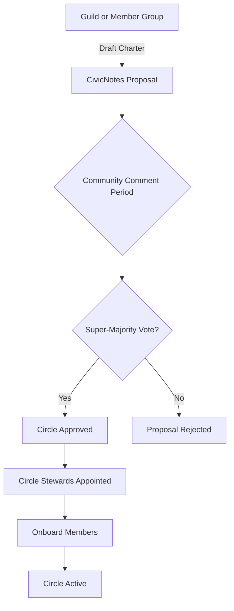
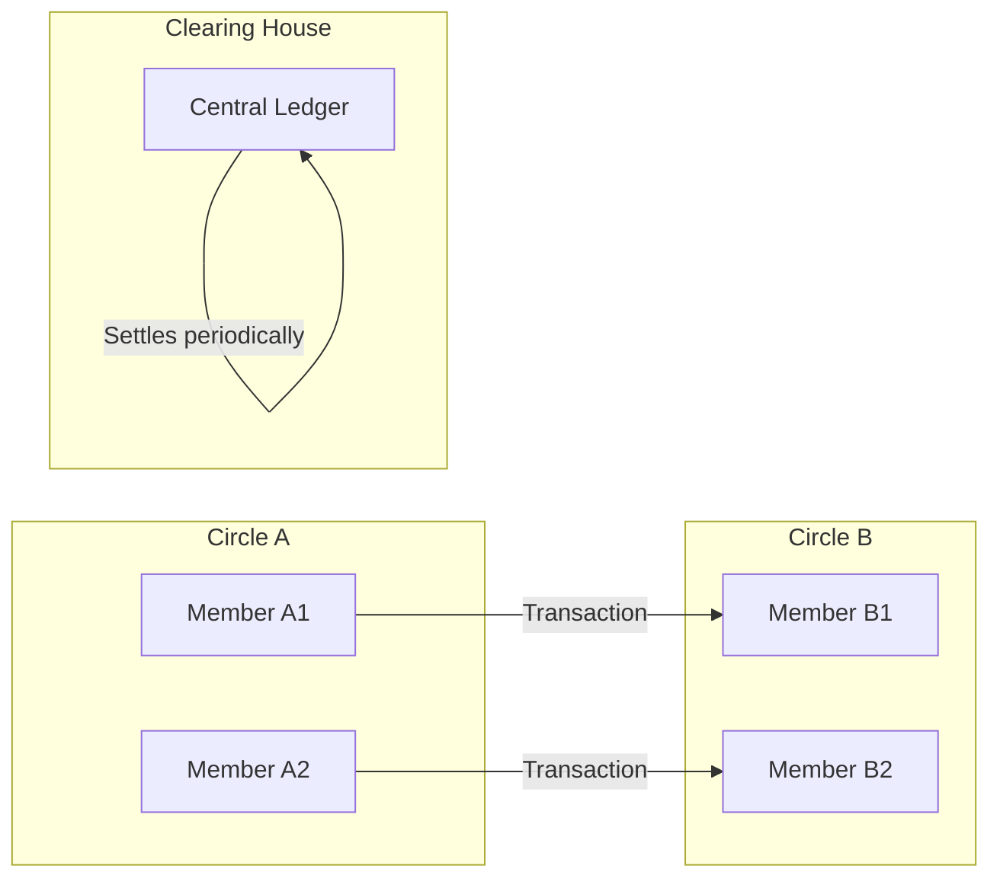
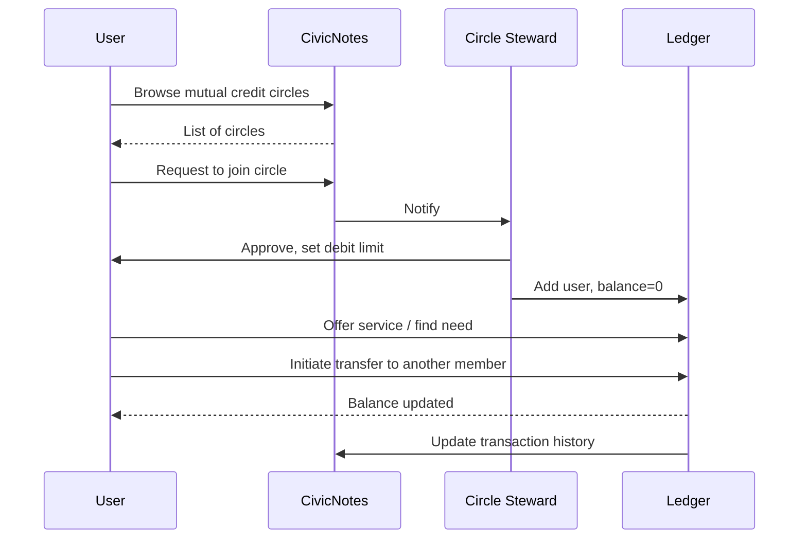
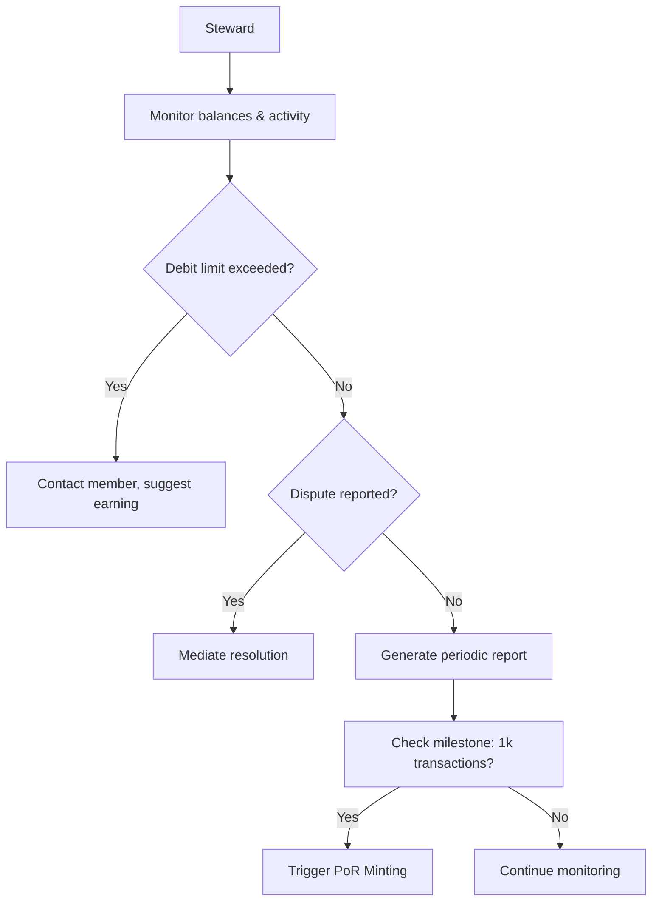
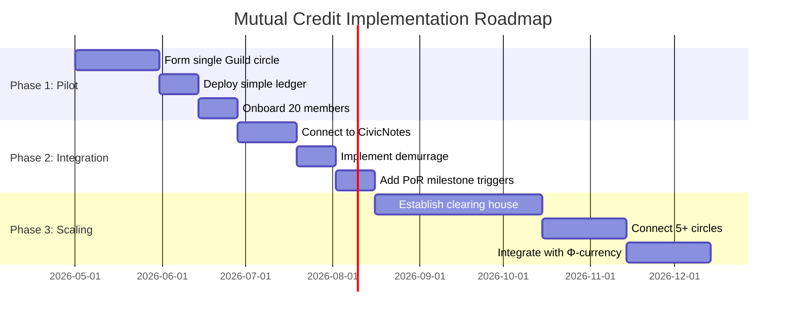

# Mutual Credit Circles

## 1. Introduction

A **Mutual Credit Circle** is a debt‑free exchange system where members extend credit to one another without interest. Transactions are recorded as credits and debits within a closed network, enabling trade without the need for national currency or debt‑based financing. Mutual credit circles are a core component of **Game B** economics: they replace speculative, interest‑bearing money with relational, community‑anchored value.

In d.conomy, mutual credit circles are managed by Guilds and integrate with Φ‑currency, the Promise Tracker, and the Φ‑Grid, making community exchange visible and accountable.

## 2. Rationale & Deep Research

### 2.1 Historical Roots

Mutual credit systems have existed for centuries:

- **Local Exchange Trading Systems (LETS)** – Developed in the 1980s in Canada and the UK, LETS enabled communities to trade goods and services using a local currency backed by mutual credit.
- **Swiss WIR Bank** – Founded in 1934, the WIR (Wirtschaftsring) is a mutual credit system that circulates a complementary currency among Swiss businesses. It operates without interest and has survived for nearly a century.
- **Time Banking** – A variant where one hour of work equals one unit, regardless of the service. Promoted by Edgar Cahn in the 1980s, time banks build community resilience.

### 2.2 Economic Benefits

- **Debt‑Free Exchange** – No interest charges; credit is created when a member makes a purchase and is extinguished when the member earns from another member.
- **Local Circulation** – Money stays within the community, increasing the local multiplier.
- **Resilience** – During economic crises (e.g., Argentina 2001, Greece 2010), mutual credit systems kept local economies alive when national currencies failed.

### 2.3 Social & Relational Benefits

- **Trust Building** – Members learn to trust each other, as credit is based on reputation and reciprocity.
- **Skill Recognition** – All contributions are valued equally (in time‑based systems) or according to community‑determined rates, fostering dignity and inclusion.
- **Reduced Inequality** – Access to credit is not determined by wealth or credit scores but by membership and trust.

### 2.4 Alignment with Solarpunk Mandala & d.conomy

| Mandala Concept | Mutual Credit Instantiation |
|-----------------|-----------------------------|
| **Game B** | Replaces debt‑based money with relational credit. |
| **Relational Depth Axis (Complexity)** | Exchange becomes a web of mutual obligation, not a transaction. |
| **Symbiotic Commonwealth (Appendix S)** | Each circle is a node in the mesh governance structure. |
| **Regenerative Economy (Appendix T)** | Integrates with Φ‑currency via clearing houses and demurrage. |

### 2.5 Critical Considerations & Responses

| Critique | Response |
|----------|----------|
| *“People won’t repay their debits.”* | Community enforcement, social pressure, and eventual membership suspension. Successful circles have low default rates. |
| *“It’s too complicated to administer.”* | Digital ledgers and mobile apps simplify tracking; many circles operate with minimal overhead. |
| *“It can’t scale.”* | Circles can be federated through bioregional clearing houses, allowing inter‑circle trade. |

## 3. Governance Model

Mutual credit circles are established and governed by Guilds (or groups of Guilds) via CivicNotes.

### 3.1 Circle Formation

1. **Proposal** – A Guild or group of 10+ members submits a CivicNotes proposal to form a mutual credit circle.
2. **Charter** – The proposal must include a charter defining:
   - Purpose (e.g., neighborhood exchange, skill sharing).
   - Membership criteria (e.g., all Guild members, geographic area).
   - Debit limits (e.g., no member may have a debit > 500 Φ‑equivalent).
   - Valuation method (time‑based, market‑referenced, or community‑determined).
   - Dispute resolution process.
3. **Community Vote** – The proposal is subject to a comment period and vote; a supermajority of Guild Council is required.

### 3.2 Ongoing Operations

- **Administration** – One or more Guild members act as “circle stewards,” responsible for onboarding, ledger maintenance, and facilitation.
- **Transparency** – All transactions are recorded on a public ledger (accessible via CivicNotes) to ensure accountability.
- **Periodic Reviews** – The circle’s health is reviewed annually: debit distribution, transaction volume, member satisfaction.



## 4. Economic Integration

### 4.1 Relationship with Φ‑Currency

Mutual credit circles can operate in two modes:

- **Standalone** – Credits are denominated in “circle units” (e.g., hours, local points). They are not convertible to Φ‑currency.
- **Integrated** – Credits are denominated in Φ‑currency. Each transaction is recorded as a transfer of Φ (but with no interest, and with demurrage applied to positive balances if configured).

The integrated mode allows circles to link with the broader d.conomy: members can use Φ to pay fees, and surpluses can be transferred to other circles.

### 4.2 Clearing Houses & Inter‑Circle Exchange

To scale mutual credit, **bioregional clearing houses** can be established. A clearing house acts as a central ledger for multiple circles, allowing:

- **Inter‑circle transfers** – A member of Circle A can pay a member of Circle B, with the clearing house adjusting inter‑circle balances.
- **Demurrage on aggregate balances** – Encourages circulation at the bioregional level.



### 4.3 Proof‑of‑Regeneration (PoR) Minting

- When a circle reaches a transaction milestone (e.g., 1,000 transactions), a PoR event is triggered.
- New Φ‑currency is minted and distributed to the circle (or to the Guild managing it) as a reward for fostering exchange.

### 4.4 Demurrage & Incentives

- Positive balances (credits) may be subject to **demurrage** (a small holding fee) to encourage spending.
- Negative balances (debits) may incur a **responsibility fee** if left unpaid beyond the grace period, but no interest is charged.
- Demurrage collected is redistributed to active members or used for community projects.

## 5. Technical Implementation

### 5.1 Data Model (Simplified)

```sql
-- Mutual credit circle tables
CREATE TABLE mutual_credit_circles (
    id UUID PRIMARY KEY,
    guild_id UUID REFERENCES guilds(id),
    name VARCHAR(255),
    charter TEXT,
    created_at TIMESTAMP,
    is_active BOOLEAN DEFAULT TRUE
);

CREATE TABLE circle_members (
    circle_id UUID REFERENCES mutual_credit_circles(id),
    user_id UUID REFERENCES users(id),
    balance_phi DECIMAL(10,2) DEFAULT 0,
    joined_at TIMESTAMP,
    max_debit DECIMAL(10,2),
    is_steward BOOLEAN DEFAULT FALSE,
    PRIMARY KEY (circle_id, user_id)
);

CREATE TABLE circle_transactions (
    id UUID PRIMARY KEY,
    circle_id UUID REFERENCES mutual_credit_circles(id),
    from_user UUID REFERENCES users(id),
    to_user UUID REFERENCES users(id),
    amount_phi DECIMAL(10,2),
    description TEXT,
    created_at TIMESTAMP,
    is_clearing_house BOOLEAN DEFAULT FALSE
);
```

### 5.2 API Endpoints (Examples)

- GET /api/mutual-credit/circles – List circles user can join.

- POST /api/mutual-credit/circles – Propose a new circle (requires CivicNotes proposal).

- POST /api/mutual-credit/transfer – Record a transaction between members.

- GET /api/mutual-credit/balance – Return member’s current balance.

- POST /api/mutual-credit/apply-demurrage – Apply demurrage to all positive balances (scheduled task).

### 5.3 Integration with CivicNotes

- **Authentication** – Same user accounts.

- **Guild Dashboard** – Shows circle activity, member balances, and transaction volume.

- **User Profile** – Displays membership in circles and current balance.

- **Promise Tracker** – PoR events triggered by milestones.

### 5.4 Smart Contract (Optional)

For decentralized implementations, a mutual credit ledger can be implemented as a smart contract that:

- Tracks member balances.

- Enforces debit limits.

- Automatically applies demurrage.

- Handles inter‑circle clearing via a federation contract.

## 6. User Flows

### 6.1 Member Journey

1. **Join** – User discovers a mutual credit circle via CivicNotes, requests membership.

2. **Onboarding** – Circle steward approves; user agrees to charter and debit limit.

3. **Exchange** – User lists services they offer; finds another member who needs something; they agree on price in Φ (or circle units); user initiates transfer.

4. **Balance Management** – User monitors balance; if debit approaches limit, they offer services to earn credits.

5. **Exit** – User may leave after settling balance.



### 6.2 Steward Journey

1. **Form Circle** – Steward drafts charter, submits CivicNotes proposal.

2. **Administer** – Onboard new members, mediate disputes, run periodic reviews.

3. **Report** – Generate transaction reports, trigger PoR events when milestones reached.

4. **Maintain** – Update debit limits, adjust demurrage rates via CivicNotes proposals.



## 7. References

### 7.1 Academic & Policy

- Boyle, D. (2002). The Money Changers: Currency Reform from Aristotle to e‑Cash. Earthscan.

- Cahn, E. (2000). No More Throw‑Away People: The Co‑Production Imperative. Essential Books.

- Lietaer, B. (2001). The Future of Money: Creating New Wealth, Work and a Wiser World. Random House.

- Seyfang, G. (2006). Harnessing the Potential of the Social Economy? Time Banks and Credit Unions in the UK. In Social Economy and the Green Economy.

- WIR Bank – Annual reports and case studies. https://www.wir.ch

### 7.2 Existing Projects

- **Community Exchange System** – Global network of mutual credit systems. https://www.community-exchange.org

- **TimeBanks USA** – National network of time banks. https://timebanks.org

- **Sardex** – Sardinia’s mutual credit system for businesses. https://www.sardex.net

### 7.3 Mandala Appendices

- **Appendix T: The Regenerative Economy** – Φ‑currency, demurrage, PoR.

- **Appendix S: The Symbiotic Commonwealth** – Mesh governance, clearing houses.

- **Appendix Q: Consciousness Infrastructure** – Φ‑Grid tracking of transaction flows.

## 8. Next Steps for Implementation

- **Pilot** – Launch a mutual credit circle within a single Guild (e.g., a neighborhood association) using a simple ledger.

- **Integrate** – Connect to CivicNotes for governance and to the Φ‑currency system for demurrage and PoR.

- **Expand** – Establish a clearing house to connect multiple circles at the bioregional level.

- **Document** – Publish case studies on member behavior, economic impact, and governance lessons.


