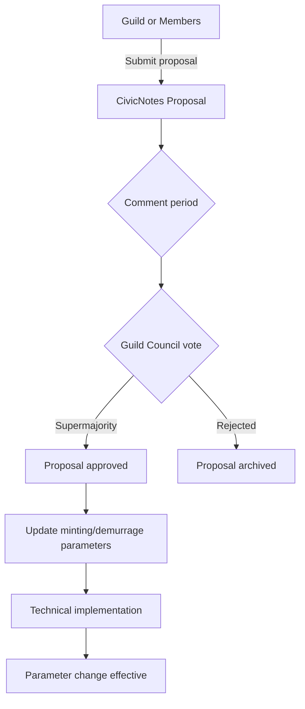
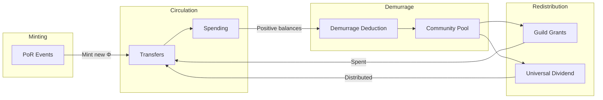
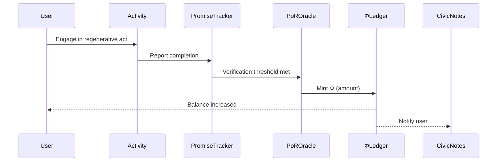
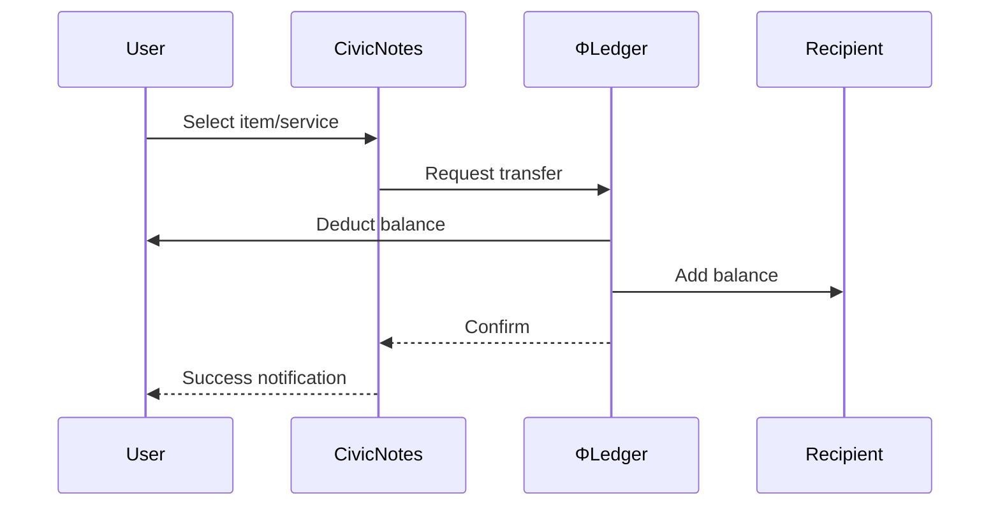
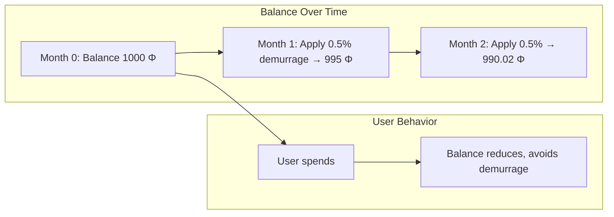
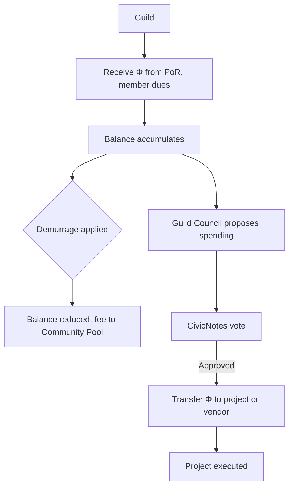
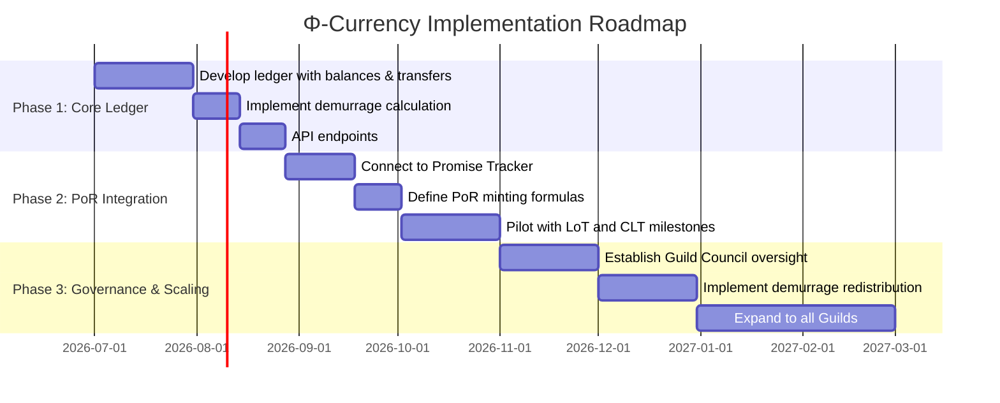

# Φ‑Currency

## 1. Introduction

**Φ‑Currency** (pronounced “phi‑currency”) is a complementary currency designed to circulate, not accumulate. It is the primary medium of exchange within d.conomy, minted exclusively through **Proof‑of‑Regeneration (PoR)** events and subject to **demurrage** (a small holding fee) that encourages spending and investment in regenerative activities. Φ‑Currency embodies the core principle of Game B economics: value is tied to life, not debt.

In d.conomy, Φ‑Currency is managed by the Guild Council, integrated with all other components (LoT, mutual credit, CLT), and its flows are visualized on the Φ‑Grid as a key indicator of community health.

## 2. Rationale & Deep Research

### 2.1 Historical Roots

The idea of a currency that decays or loses value over time (demurrage) dates back to ancient Egypt and medieval Europe, but was formalized by economist **Silvio Gesell** (1862–1930). Gesell argued that money should be a “medium of exchange, not a store of value.” His concept of **free money** (Freigeld) included a stamp scrip mechanism where holders paid a periodic fee to keep currency valid. This was successfully implemented in the **Wörgl Experiment** (Austria, 1932–33), where a local currency with demurrage stimulated economic activity and reduced unemployment.

Complementary currencies have since proliferated:

- **WIR Bank** (Switzerland, 1934–present) – A mutual credit system for businesses.
- **Chiemgauer** (Germany, 2003–present) – A regional currency with demurrage that supports local non‑profits.
- **Bristol Pound** (UK, 2012–2021) – A local currency that kept money circulating locally.

### 2.2 Economic Benefits

- **Encourages Circulation** – Demurrage penalizes hoarding, incentivizing spending and investment. This increases the velocity of money, which can compensate for a smaller supply.
- **Stabilizes Local Economies** – By insulating from national currency fluctuations, local currencies build resilience.
- **Funds Public Goods** – Demurrage collected can be redistributed to community projects (e.g., via the Guild Council).

### 2.3 Social & Environmental Benefits

- **Rewards Regeneration** – Minting only through PoR aligns the money supply with measurable ecological and social good.
- **Shifts Values** – Using Φ‑Currency for everyday transactions reinforces a consciousness of stewardship and community.
- **Reduces Inequality** – Because money does not accumulate indefinitely, wealth concentration is mitigated.

### 2.4 Alignment with Solarpunk Mandala & d.conomy

| Mandala Concept | Φ‑Currency Instantiation |
|-----------------|--------------------------|
| **Game B** | Replaces debt‑based, interest‑bearing money with flow‑oriented, demurrage‑based currency. |
| **Axiological Axis (Care)** | Minting tied to regenerative outcomes; demurrage funds community care. |
| **Temporal Orientation Axis (Courage)** | Demurrage encourages present‑oriented action; minting seeds future regeneration. |
| **Symbiotic Commonwealth (Appendix S)** | Currency governed by Guild Council; flows across mesh. |
| **Regenerative Economy (Appendix T)** | Direct implementation of Appendix T’s Φ‑currency and demurrage model. |

### 2.5 Critical Considerations & Responses

| Critique | Response |
|----------|----------|
| *“Demurrage is a tax on holding money.”* | It is a fee that funds community benefit; users can avoid it by spending or investing quickly. |
| *“It won’t be accepted by businesses.”* | Pilot with Guild‑member businesses first; offer conversion to fiat at limited exchange points if needed. |
| *“Minting only through PoR may limit supply.”* | Supply expands with regeneration; if needed, parameters can be adjusted by Guild Council. |

## 3. Governance Model

Φ‑Currency is governed by the **Guild Council** (one representative per Guild) with oversight from CivicNotes.

### 3.1 Minting Parameters

- **PoR Exchange Rates** – How much Φ is minted per unit of regenerative outcome (e.g., 1 Φ per lb of food grown, 100 Φ per promise addressed).
- **Maximum Supply** – The Guild Council may set an upper limit, but typically supply is uncapped and adjusts to demand.
- **Minting Frequency** – PoR events trigger minting automatically via the Promise Tracker.

### 3.2 Demurrage Rate

- **Rate Setting** – The Guild Council sets the demurrage rate (e.g., 0.5% per month) based on circulation velocity.
- **Adjustment** – If money is circulating too slowly, rate increases; if too fast, rate decreases.
- **Redistribution** – Demurrage collected is held in a **Community Pool** and redistributed via CivicNotes proposals (e.g., grants to Guilds, universal basic dividend).

### 3.3 Policy Process

All changes to minting parameters or demurrage rates follow the CivicNotes proposal process:

1. **Proposal** – Any Guild or group of 10 members submits a proposal.
2. **Comment Period** – 14 days for community feedback.
3. **Guild Council Vote** – Supermajority (e.g., 60%) required for adoption.
4. **Implementation** – Approved changes are enacted by the technical team.



## 4. Economic Integration

### 4.1 Minting via Proof‑of‑Regeneration

Φ‑Currency is created only when a PoR event is verified:

- **LoT Milestone** – Item borrowed 100 times → 50 Φ minted to LoT Guild.
- **Promise Addressed** – CivicNote verified “addressed” → 100 Φ minted (split: 50% to note author, 25% to endorsing Guild, 25% to official).
- **CLT Acquisition** – New property acquired → 1000 Φ minted to CLT.
- **Mutual Credit Milestone** – Circle reaches 1,000 transactions → 500 Φ minted to circle.

### 4.2 Demurrage Mechanics

- **Calculation** – Demurrage is applied periodically (e.g., monthly) to all positive balances above a small exemption (e.g., first 100 Φ exempt).
- **Formula** – `new_balance = balance * (1 - rate)`.
- **Distribution** – Demurrage collected flows into the Community Pool.

### 4.3 Redistribution of Demurrage

The Community Pool can be allocated through:

- **Universal Basic Dividend** – Distributed equally to all active users.
- **Guild Grants** – Fund proposals that support regeneration.
- **Liquidity Pools** – Provide exchange liquidity between Φ and fiat if needed.



### 4.4 Relationship with Mutual Credit

Mutual credit circles can operate in two modes:

- **Standalone** – Circle uses its own units; not convertible to Φ.
- **Integrated** – Circle uses Φ as its unit; transactions recorded on Φ ledger, subject to demurrage.

### 4.5 Relationship with LoT & CLT

- **Borrowing Fees** – Paid in Φ.
- **Bond Issuance** – CLTs issue bonds denominated in Φ.
- **PoR Minting** – Triggers from LoT and CLT milestones.

## 5. Technical Implementation

### 5.1 Data Model (Simplified)

```sql
-- Φ‑Currency ledger tables
CREATE TABLE phi_accounts (
    user_id UUID PRIMARY KEY REFERENCES users(id),
    balance_phi DECIMAL(10,2) DEFAULT 0,
    last_demurrage_applied TIMESTAMP
);

CREATE TABLE phi_transactions (
    id UUID PRIMARY KEY,
    from_user UUID REFERENCES users(id),
    to_user UUID REFERENCES users(id),
    amount_phi DECIMAL(10,2),
    transaction_type VARCHAR(50), -- 'transfer', 'mint', 'demurrage', 'redistribution'
    reference_id UUID, -- points to PoR event, promise, etc.
    created_at TIMESTAMP
);

CREATE TABLE por_events (
    id UUID PRIMARY KEY,
    event_type VARCHAR(50), -- 'lot_milestone', 'promise_addressed', 'clt_acquisition', etc.
    source_id UUID, -- references specific component (e.g., lot_item_id)
    amount_minted_phi DECIMAL(10,2),
    verified_by UUID REFERENCES users(id),
    verified_at TIMESTAMP,
    created_at TIMESTAMP
);
```

### 5.2 API Endpoints (Examples)

- GET /api/phi/balance – Return current balance.

- POST /api/phi/transfer – Transfer Φ to another user.

- GET /api/phi/transactions – List transaction history.

- POST /api/phi/por – Register a PoR event (requires verification).

- GET /api/phi/demurrage – Get current demurrage rate and next application time.

### 5.3 Integration with CivicNotes

- **Authentication** – Same user accounts.

- **User Profile** – Displays Φ balance, transaction history, PoR contributions.

- **Guild Dashboard** – Shows Guild treasury balance, pending PoR events.

- **Promise Tracker** – PoR events are created from verified promises.

### 5.4 Smart Contract (Optional)

For decentralized implementations, a Φ‑currency smart contract can:

- Maintain user balances.

- Enforce demurrage via periodic balance adjustments.

- Mint new Φ when PoR events are verified (via oracle).

- Allow transfers.

- Distribute demurrage to the Community Pool.

## 6. User Flows

### 6.1 Earning Φ (PoR Participant)

1. User engages in regenerative activity – e.g., gardens, volunteers at LoT, gets a promise addressed.

2. Activity is verified – via Promise Tracker or LoT system.

3. PoR event is triggered – minting formula applied.

4. Φ credited to user’s account – notification sent.



### 6.2 Spending Φ

1. User finds a service or item – e.g., borrows from LoT, pays mutual credit circle debt.

2. User initiates transfer – via CivicNotes or integrated app.

3. Recipient receives Φ – balance updates.

4. Transaction recorded – visible in history.



### 6.3 Demurrage Impact

1. Demurrage period ends – system calculates new balance.

2. Balance reduced – if positive, fee deducted.

3. Deducted Φ flows to Community Pool.

4. User notified – sees reduction in balance with explanation.



### 6.4 Guild Treasury Management

1. Guild receives Φ – from PoR events, member dues, or sales.

2. Guild allocates funds – via CivicNotes proposals (e.g., buy new LoT item).

3. Treasury balance visible – on Guild dashboard.

4. Demurrage affects treasury – incentivizes timely spending.



## 7. References

### 7.1 Academic & Policy

- Gesell, S. (1916). The Natural Economic Order.

- Lietaer, B. (2001). The Future of Money.

- Kennedy, M., & Lietaer, B. (2004). Regional Money.

- **Demurrage Currency Literature** – Various case studies, including Wörgl, Chiemgauer.

### 7.2 Existing Projects

- **Chiemgauer** – Regional currency in Germany with demurrage. https://www.chiemgauer.info

- **Bristol Pound** – Local currency (now digital). https://bristolpound.org

- **Sardex** – Business‑to‑business mutual credit in Sardinia.

- **WIR Bank** – Long‑running mutual credit system.

### 7.3 Mandala Appendices

- **Appendix T: The Regenerative Economy** – Foundational document for Φ‑currency, PoR, demurrage.

- **Appendix Q: Consciousness Infrastructure** – Φ‑Grid tracking of currency flows.

- **Appendix S: The Symbiotic Commonwealth** – Governance structures.

## 8. Next Steps for Implementation

- Develop Φ‑Ledger – Create a simple ledger with demurrage calculation and minting API.

- Integrate with PoR – Connect Promise Tracker events to minting.

- Pilot with Guild – Launch Φ‑currency within a single Guild, using it for LoT borrowing and mutual credit.

- Governance Setup – Establish Guild Council and first demurrage rate.

- Expand – Roll out to more Guilds and components.


